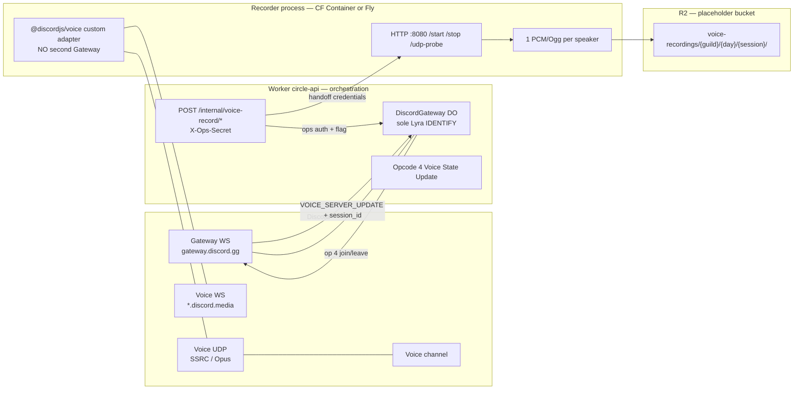

# Spike A — Discord voice multi-track recording (CF Containers)

**Status:** draft spike. **Not production-armed.** Do not deploy this path, do not
`wrangler secret put`, do not paste tokens or webhook URLs.

**Go/no-go:** can a Cloudflare Container send and receive **Discord voice UDP** on a
short real session? If UDP fails, stop. Evaluate Fly (or similar) for the recorder
only. Keep the Worker for Gateway + HTTP orchestration.

Screen share = spike B. Typing indicator / ack routes = out of scope.

## Why a Container

Live `circle-api` is a Worker: HTTP + one Durable Object (`DiscordGateway`) that
owns the **only** Lyra Gateway WebSocket. Classic Workers cannot hold Discord
voice UDP. A long-lived process (CF Container, or Fly if UDP fails) must join
voice and dump tracks. Orchestration stays on the Worker.

## Architecture



Trust rule: the Container may open the **voice** WebSocket and UDP sockets. It
must **never** open `gateway.discord.gg` / `gateway.discord.com` with the Lyra
bot token. A second IDENTIFY on that token kicks the Worker DO.

## Trust boundaries

| Zone | May hold | Must not |
|---|---|---|
| Worker | `DISCORD_BOT_TOKEN` (existing Gateway + REST), `GATEWAY_OPS_SECRET`, optional R2 binding | Second Gateway socket; client-minted grants |
| Container secrets | Voice-session handoff (`endpoint`, voice `token`, `session_id`); optional **REST-only** bot token copy | Gateway IDENTIFY / RESUME; logging tokens |
| R2 | Encoded tracks + `manifest.json` | Bot token, ops secret, voice-server token |
| Git / wrangler.toml | Placeholders (`REPLACE_ME`) | Real bucket IDs, tokens, webhook URLs |
| Public HTTP | `/health`, `/interactions` | `/internal/voice-record/*` (ops secret + flag) |

`VOICE_SERVER_UPDATE.token` is a **voice-server** token, not the bot token. Still
secret: treat like a session credential, never log.

## Token handling — never a second Gateway

1. **Lyra Gateway stays in `DiscordGateway`.** Spike A adds Opcode 4
   (`Voice State Update`) on that existing socket and captures
   `VOICE_SERVER_UPDATE` + the bot's `session_id` from `VOICE_STATE_UPDATE`.
2. **Recorder joins with a custom `@discordjs/voice` adapter.** The adapter
   injects the handoff and **no-ops** `sendPayload` (Opcode 4 already sent).
3. **Do not** put `DISCORD_BOT_TOKEN` in the Container for a `discord.js` Client
   / `GatewayIntentBits` login. REST-only use is optional and later.
4. Dedicated second-bot token (own Gateway in the Container) is a **last-resort
   product decision**, not this spike. It would not kick Lyra, but it violates
   the “never second Gateway” operating rule we are testing.

Temp-voice already ignores the bot (`planTempVoiceEvent` → `self` / `bot`).
Lyra joining a temp room for recording must not spawn or steal rooms. Occupancy
will include the bot until `/stop` sends Opcode 4 with `channel_id: null`.

## R2 key layout

Bucket name is **operator-created**. Do not invent IDs in git.

```text
voice-recordings/
  {guildId}/
    {yyyy-mm-dd}/
      {sessionId}/
        manifest.json
        udp-probe.json          # go/no-go artifact
        tracks/
          {userId}.pcm          # raw s16le 48kHz stereo (spike)
          {userId}.ogg          # optional encode later
```

`manifest.json` sketch:

```json
{
  "schema": "circle-voice-spike-a/v1",
  "sessionId": "vr_…",
  "guildId": "…",
  "channelId": "…",
  "startedAt": "2026-09-10T12:00:00.000Z",
  "stoppedAt": null,
  "tracks": [{ "userId": "…", "key": "voice-recordings/…/tracks/….pcm" }]
}
```

Prefix is org/guild-scoped. No cross-guild ambient keys.

## Start / stop API (Worker)

Same auth as `POST /internal/discord-gateway/ensure`:

- Header `X-Ops-Secret` **or** `Authorization: Bearer …`
- Compared with `GATEWAY_OPS_SECRET` (constant-time-ish; see `opsSecretOk`)

| Method | Path | Armed when | Success |
|---|---|---|---|
| `POST` | `/internal/voice-record/start` | `VOICE_RECORD_SPIKE_A=1` | `202` + session id (or `503` if no recorder bound) |
| `POST` | `/internal/voice-record/stop` | same | `200` + dump summary |

Flag **absent / not `1`/`true` → `404`** (same as unknown routes). Production
`[vars]` must **not** set the flag.

Start body:

```json
{
  "guildId": "<snowflake>",
  "channelId": "<snowflake>",
  "sessionId": "<optional vr_…>"
}
```

Stop body: `{ "sessionId": "vr_…" }`.

Guild must match `DISCORD_GUILD_ID` when that env is set (fail closed). Channel
is any guild voice channel snowflake — including a temp room id from the
existing VOIX hub. Do not pass the hub (`DISCORD_VOICE_HUB_CHANNEL_ID`) as the
record target (validated).

## Feature flags / commented bindings

| Knob | Default | Effect |
|---|---|---|
| `VOICE_RECORD_SPIKE_A` | unset | Routes 404; Gateway does not persist handoff |
| `VOICE_RECORDER` DO / Container | **commented** in `wrangler.toml` | No migration, no image push |
| `VOICE_RECORDER_HTTP_URL` | unset | Optional Fly / local recorder |
| `VOICE_RECORDINGS` R2 | **commented** | Placeholder `REPLACE_ME_circle-voice-recordings` |

Uncommenting bindings is an **operator** step after the UDP test, not a default
`wrangler deploy` of `main`.

Official CF Containers pattern (docs, Aug 2026): Worker exports a class
extending `Container` from `@cloudflare/containers`; `wrangler.toml` has
`[[containers]]` + `[[durable_objects.bindings]]` + `new_sqlite_classes`
migration; image is `linux/amd64`. Container HTTP is reached via
`getContainer(env.VOICE_RECORDER, id).fetch`. R2 from the container uses
**outbound handlers** (`outboundByHost`, `@cloudflare/containers` ≥ 0.2) —
HTTP to a virtual host, resolved in the Worker. Outbound handlers **only**
intercept HTTP/HTTPS on 80/443.

## UDP go/no-go (Mickael)

Official docs (2026): end-users cannot send inbound TCP/UDP to a Container;
Worker↔Container is HTTP. When `enableInternet` is false, non-80/443 egress is
denied. Discord voice needs **outbound UDP** to the voice server after the
voice WebSocket handshake. Whether that UDP works with default internet
egress is **the experiment**. Do not assume.

### Provision (operator, not this PR)

1. Create an R2 bucket (name of your choosing). Put the id only in dashboard /
   local untracked config — not in git.
2. Paid Workers plan (Containers requirement).
3. Uncomment the spike bindings on a **throwaway experiment** Worker if you
   do not want to touch `circle.roxabi.dev`. Prefer a separate Worker name.
4. Set Container secrets **in the dashboard / `wrangler containers`**, never
   commit them. Recorder does not need the bot token if handoff works.
5. Set `VOICE_RECORD_SPIKE_A=1` only on that experiment.
6. Build/push the image from `apps/circle-voice-recorder/Dockerfile`.

### Protocol (short real session)

1. Confirm Lyra Gateway is connected:
   `POST /internal/discord-gateway/ensure` + `X-Ops-Secret`.
   **Do not** start a second `discord.js` Client with the Lyra token.
2. Two humans join a **temp VOIX room** (not the hub). Copy that `channelId`.
3. `POST /internal/voice-record/start` with `guildId` + `channelId`.
4. Worker sends Opcode 4 on the existing DO; waits for handoff; POSTs
   `/start` to the recorder.
5. Recorder: voice WS connect + UDP IP discovery. Hit
   `POST /udp-probe` on the container (via Worker or SSH) if join hangs.
6. Speak ~20s (two speakers). `POST /internal/voice-record/stop`.
7. Check R2 (or container `/tmp` if R2 unset) for two track files + manifest.

### Pass / fail

| Result | Verdict |
|---|---|
| Voice WS up **and** UDP IP discovery / RTP in + out | **Go** — continue Container path |
| Voice WS up, UDP timeout / no RTP | **No-go** — stop; Fly for recorder only |
| Join kicks Lyra / Gateway close 4000-class | **Abort** — second Gateway leaked; fix before retry |
| Temp rooms spawn/delete wrongly | **Abort** — do not proceed |

Probe helper (no Discord session): Container `POST /udp-probe` sends a UDP
datagram to `UDP_PROBE_HOST:UDP_PROBE_PORT` (default `1.1.1.1:53`) and waits
for any reply. A DNS reply proves generic UDP egress; it does **not** prove
Discord RTP. Always run the real session before calling Go.

## Fallback — Fly (recorder only)

If UDP no-go:

1. Keep Worker routes, flag, Opcode 4, handoff, R2 layout.
2. Run `apps/circle-voice-recorder` as a Fly machine (`fly.toml` not in this
   spike). Set `VOICE_RECORDER_HTTP_URL` to that origin.
3. Same `X-Ops-Secret` on recorder HTTP.
4. Do not move Gateway off the Worker.

## Scaffold vs deferred

| In this PR | Deferred |
|---|---|
| Design + UDP checklist | Live Container deploy / secrets |
| Worker start/stop + unit tests | Screen share (spike B) |
| Opcode 4 + handoff store (flag-gated) | Production-quality encode / mix |
| Recorder HTTP stub + custom adapter + placeholder dump | Outbound-handler R2 binding |
| Commented wrangler / R2 placeholders | Fly `fly.toml` |
| Gateway-URL guard | Second Discord application |

## Commands (local, no secrets)

```sh
bun run --filter @roxabi/circle-api test
bun run --filter @roxabi/circle-voice-recorder test
bun run --filter @roxabi/circle-api typecheck
```
